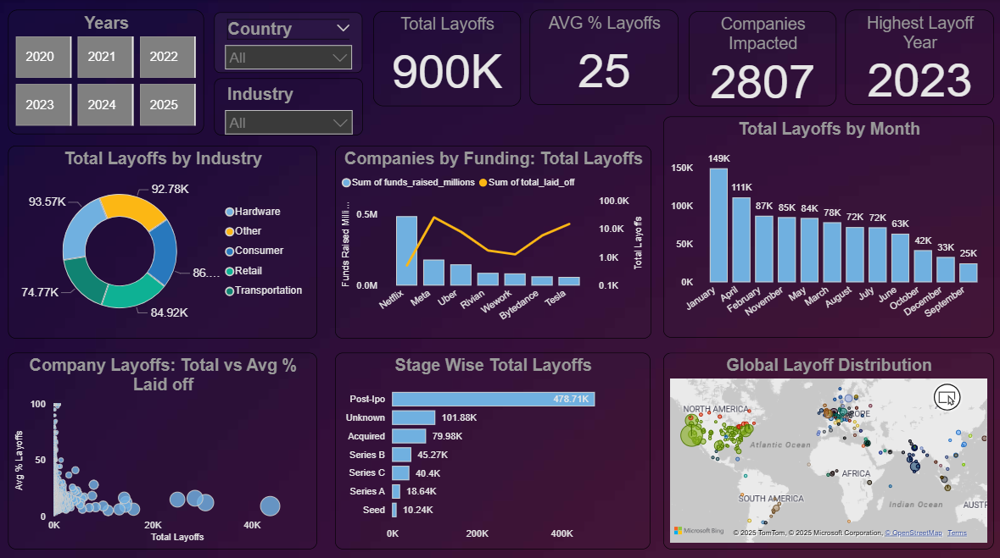

# 🌍 Global Layoff Trends Post-COVID: Data Analysis & Visualization

## 🔹 Project Objective
The COVID-19 pandemic caused unpredictable disruptions in global workforce. This project uncovers Global Layoff Trends Post-COVID (2020–2025), analyzing how industries, company stages, funding levels, and locations influenced workforce reductions worldwide. By transforming raw data into interactive and insightful visualizations, it uncovers hidden patterns, highlights the most affected sectors and regions, and tells a clear story of evolving job market dynamics.
The goal is to deliver actionable, data-driven insights that are easy to explore and understand, enabling recruiters, analysts, investors and policymakers to quickly grasp complex workforce shifts.

--- 

## 🔹 Dataset
- *Source:* Kaggle / Public dataset
- *Dataset Link:* https://www.kaggle.com/datasets/swaptr/layoffs-2022
- *Rows:* 4150 
- *Columns:* company, industry, location, stage, funds_raised_millions, total_laid_off, percentage_laid_off, date, country, etc.  
- *Description:* The dataset contains layoffs information for global companies from 2020 to 2025 (April). It has been cleaned, missing values handled, and columns transformed for analysis.
- *Tools & Technologies:* Python(pandas, matplotlib, seaborn), SQL, Power Bi

---

## 🔹 Analysis Steps
1. *Data Cleaning & Preprocessing* 
   - Standardizing categorical columns (company, industry, location)
   - Handling missing values (NaN) logically
   - Converting dates and numeric columns
   - Removing columns not needed for analysis
2. *SQL Analysis*
   - Aggregating layoffs by year, month, industry, country, company, location, stage, and funding  
   - Ranking top companies and countries by layoffs  
   - Computing averages and percentages for deeper insights  
3. *Visualizations & Storytelling*
   - Time-series analysis of layoffs (year-wise, month-wise, month-year)  
   - Country-wise and location-wise analysis  
   - Company-wise, industry-wise, stage-wise layoffs, % wise layoffs
   - Top industries by total layoffs each year
   - Stage-wise total layoffs vs funds raised
   - Relation between total layoffs and percentage layoffs
   - Interactive and professional storytelling insights for each graph  
4. *Dashboard Creation*
   - Created dashboard using Power Bi
   - Visualize trends in global layoffs across different parameters.
5. *Insights & Business Impact*
   - Identifying high-risk industries, and stages  
   - Understanding global workforce trends  
   - Linking funding, company stage, and layoffs patterns.

---

## 🔹 Analysis & Key Visualizations
To understand the global layoff patterns post-COVID, I analysed the dataset across time, industry, country, location, company, stage and funding. The visualizations below highlight key trends and insights.
##  📌  Time-Based Analysis
###  🗓️  Year-wise Layoffs Trend

The year-wise trend reveals a sharp surge in layoffs, peaking in **2023** with over 300,000 job cuts. Between 2021 and 2023, workforce reductions accelerated dramatically, largely reflecting the prolonged impact of the COVID-19 pandemic on global businesses and its aftereffects shook the job market. This highlights how economic recovery was uneven, with many industries forced to downsize even after the initial crisis and the employees ended up paying the price.

##  📌  Industry & Company Analysis
###  🏭  Top Industry by Total Layoffs Each Year

Breaking it down year by year. Layoffs didn't hit every industry equally. In 2020, **Travel** was worst affected, followed by **Consumer** in 2021 and **Retail** in 2022. By 2023, layoffs spread broadly across sectors, but in **2024-2025, Hardware** clearly became the Hardest hit, showing how the impact of the pandemic kept shifting over time.

###  🏢  Top Companies by Funding: Total Layoffs

Looking at the top 10 companies, some interesting contrasts emerge. Netflix raised the highest funding yet had the fewest layoffs, while Meta faced the largest cuts. Flipkart, despite the lowest funding, also kept layoffs low. This highlights that funding isn’t everything, strategy and timing play a big role.

##  📌  Stage-wise Layoffs Trend & Funding Analysis
###  💰  Stage-wise Total Layoffs vs Funds Raised

When we look at total layoffs alongside company stage and funding, a clear pattern emerges: Post-IPO companies not only had the highest layoffs but also raised the most funding—over 1.75 (Million $). While Series I startups experienced the fewest layoffs, which aligns with their comparatively lower funding.

##  📊  Explore More Visualizations
 
Only a few key charts are shown here. For the detailed visualizations with story telling insights, explore the full [Jupyter Notebook](Jupyter-Notebook/Global%20Layoff%20Analysis.ipynb) or check the [Visualizations](./images)

---

## 🔹 Power Bi Dashboard
**Layoffs Dashboard Overview:**
This Dashboard visualizes trends in global layoffs across different parameters like industry, company, funding, stage-wise,
and geography.

You can download the full interactive dashboard here:
[Power Bi Dashboard File](Dashboard/Post-Covid%20Layoffs.pbix)

---

## 🔹 Insights & Key Findings
- *Post-COVID layoffs peaked* between 2021–2023, with Jan 2023 showing the highest layoffs globally.  
- *Industry impact:* Hardware, Consumer, Retail, and Travel were heavily affected.  
- *Company funding doesn’t guarantee stability:* Even highly funded companies like Meta, Tesla, Intel had massive layoffs.  
- *Stage sensitivity:* IPO-stage firms shed large absolute numbers, while early-stage startups faced sharp percentage cuts.  
- *Geography matters:* The U.S., especially SF Bay Area and Seattle, dominated layoffs.  
- *Top companies affected:* Intel, Microsoft, Amazon, Meta, Netflix, Tesla, Flipkart.  
- *Major insights:* Workforce planning, adaptive models, and risk management are critical for resilience.

---

## 🔹 Future Outlook / Business Impact
*Questions & Learnings*:  
1. Why do some industries collapse faster than others during global shocks?
   - Because not all sectors are built equally. Hardware, retail, and travel showed us how fragile traditional models can be when the world slows down. These industries           urgently need to build resilient, adaptive strategies if they want to withstand the next disruption.¶
2. If money means power, why did giants like Meta, Tesla, and Intel still cut jobs?
   - Funding doesn’t equal stability. These companies had billions at their disposal, yet even they resorted to massive layoffs. The truth is clear: financial strength alone      cannot shield a company from poor planning or sudden downturns.
3. Are all companies equally at risk, or do some stages carry higher dangers?
   - Not at all. Startups often face percentage-heavy cuts, but IPO-stage companies pose the largest systemic workforce risks. Their sheer size means even a small adjustment      can put hundreds of thousands of jobs on the line - something policymakers and investors must keep in mind.
4. Why did the U.S. dominate the layoff charts?
   - Because of concentration risk. With hubs like SF Bay Area and Seattle driving global tech, the U.S. became the epicenter of layoffs. The lesson? Diversifying talent          globally can spread the risk and create a more balanced, shock-proof workforce.
5. What’s the real fix to prevent mass layoffs?
   - It starts with smarter workforce planning. Companies need to rethink how they hire and scale - focusing on sustainable growth instead of overexpansion that eventually        forces painful mass cuts.
---

## 🔹 This project not only visualizes layoffs but also provides a lens into how businesses can prepare for future shocks in     a more sustainable and resilient way.
